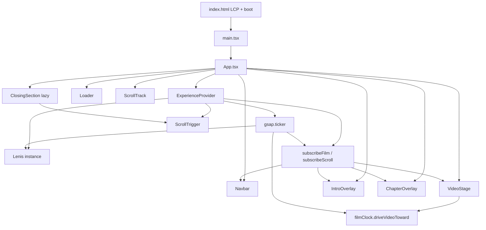
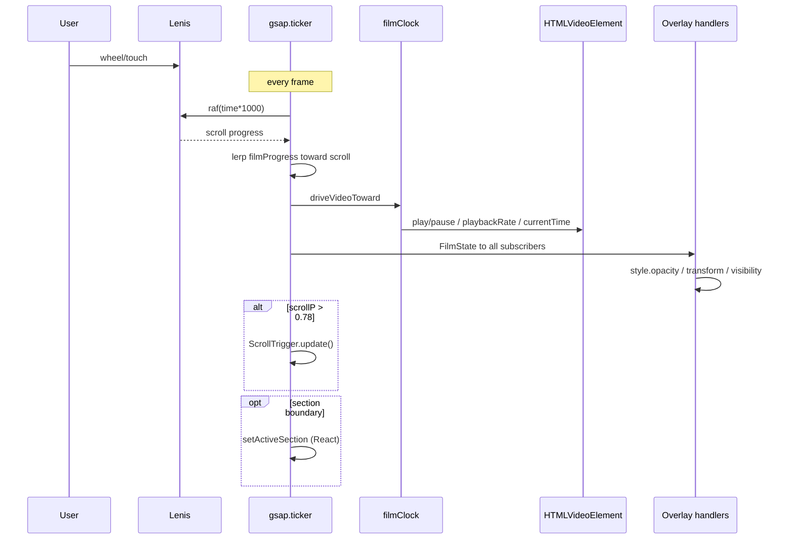

# 01 — Project Architecture

**Project:** Home Nº 134 (`home-134`)  
**Audit date:** 2026-07-28  
**Scope:** Read-only architecture & systems map (no code changes)  
**Primary codebase:** repository root `src/` (not the nested `RealEstWebsite-main/` duplicate)

---

## 1. Executive architecture verdict

This is a **single-page, scroll-driven cinematic film experience** built with React 19 + Vite 8. There is no router, no Three.js/WebGL, no Framer Motion (despite README mentions), and no backend.

The rendering model is:

1. **Native HTML `<video>`** as a full-viewport fixed stage  
2. **Lenis** as the smooth-scroll intent bus  
3. **GSAP ticker** as the single RAF master clock  
4. **Imperative DOM writes** (not React state) for per-frame overlay opacity/transform  
5. **React** for structure, boot orchestration, and coarse UI state  

**Overall architecture health: 68 / 100**

| Dimension | Score | Notes |
|-----------|------:|-------|
| Clarity of intent | 82 | Film-clock + scroll-intent separation is deliberate and documented in code |
| Separation of concerns | 70 | Context is a god-object for scroll + film + mute + load + section |
| Scalability | 55 | Fine for one film; hard to extend to multi-page / multi-asset |
| Production packaging | 48 | Nested duplicate project + 68MB references inflate the tree |
| Performance architecture | 58 | Correct patterns (DOM sync hooks) undermined by scrubbing model + dense overlays |
| Maintainability | 72 | Small LOC (~1.3k), clear folders, TypeScript |

---

## 2. Folder structure

```
RealEstWebsite-main (1)/
├── audit/                          ← this audit deliverable
├── index.html                      ← LCP shell, boot loader, font preloads
├── package.json
├── package-lock.json
├── vite.config.ts
├── tsconfig*.json
├── .oxlintrc.json
├── README.md
├── public/
│   ├── favicon.svg
│   ├── icons.svg                   ← UNUSED (Vite starter social icons)
│   ├── fonts/                      ← 4× self-hosted woff2
│   └── videos/
│       ├── cinematic.mp4           ← ~8.63 MB served film
│       └── poster.jpg              ← 1920×1080, ~148 KB
├── references/
│   ├── cinematic-video.mp4         ← ~65 MB master (must not ship)
│   └── screen-recording.mp4        ← ~3.6 MB UX reference
├── RealEstWebsite-main/            ← FULL NESTED DUPLICATE (~77 MB)
│   └── (parallel copy of project; drifts from root)
└── src/
    ├── main.tsx
    ├── App.tsx
    ├── assets/                     ← UNUSED Vite starter assets
    ├── components/
    │   ├── layout/
    │   │   ├── Navbar.tsx
    │   │   └── VideoStage.tsx
    │   └── ui/
    │       └── Loader.tsx          ← returns null; drives #boot-loader
    ├── context/
    │   └── ExperienceContext.tsx   ← Lenis + GSAP ticker + film bus
    ├── lib/
    │   ├── constants.ts            ← sections, SITE, time mapping
    │   ├── filmClock.ts            ← video drive / soft-play / seek
    │   └── motion.ts               ← easing / window opacity / lobes
    ├── sections/
    │   ├── ScrollTrack.tsx         ← 6× 100svh invisible markers
    │   ├── IntroOverlay.tsx
    │   ├── ChapterOverlay.tsx
    │   └── ClosingSection.tsx      ← lazy-loaded
    └── styles/
        └── globals.css
```

### Structural risks

| Risk | Evidence | Impact |
|------|----------|--------|
| Nested duplicate project | `RealEstWebsite-main/` differs in hashes from root for App, context, filmClock, VideoStage, vite, index | Engineer may edit the wrong tree; deploy risk |
| References in repo | `references/*.mp4` ≈ 68.5 MB | Accidental publish / clone cost |
| Dead assets | `src/assets/*`, `public/icons.svg` | Noise; README still mentions “Cursor” which does not exist |
| README drift | Lists Framer Motion; package.json has none | Onboarding confusion |

---

## 3. Stack & dependency graph

### Runtime dependencies

| Package | Version | Role in architecture | Bundle note |
|---------|---------|----------------------|-------------|
| `react` / `react-dom` | ^19.2.7 | UI tree, StrictMode, lazy/Suspense | Manual chunk `react-vendor` |
| `gsap` | ^3.15.0 | Master ticker, loader/intro/closing timelines, ScrollTrigger | Manual chunk `gsap` |
| `lenis` | ^1.3.25 | Smooth scroll; `autoRaf: false` (driven by GSAP) | Manual chunk `lenis` |
| `react-icons` | ^5.7.0 | 4 Heroicons (menu + mute) | Tree-shakeable named imports; still a large package surface |

### Dev / build

| Package | Role |
|---------|------|
| `vite` ^8.1.1 | Bundler / dev server |
| `@vitejs/plugin-react` | React transform |
| `@tailwindcss/vite` + `tailwindcss` ^4.3.3 | Utility CSS |
| `typescript` ~6.0.2 | Typecheck (`tsc -b`) |
| `oxlint` | Lint only |

### Dependency graph (logical)



**There is no React Router, no state library, no Three.js, no Framer Motion.**

---

## 4. Component hierarchy

```
StrictMode
└─ App
   └─ ExperienceProvider                 ← owns Lenis + ticker + context value
      ├─ Loader                          ← null UI; animates #boot-loader
      ├─ Navbar                          ← fixed; re-renders on activeSection
      ├─ VideoStage                      ← fixed z-0 <video> + grade + mute CTA
      ├─ IntroOverlay                    ← fixed z-20 intro copy
      ├─ ChapterOverlay                  ← fixed z-20 × 6 chapter panels
      └─ main
         ├─ ScrollTrack                  ← relative z-10; 6 × 100svh sections
         └─ Suspense
            └─ ClosingSection            ← relative z-30 solid ink CTA
```

### Mount-time vs scroll-time responsibilities

| Component | Mount / React | Per-frame (imperative) |
|-----------|---------------|-------------------------|
| `ExperienceProvider` | Create Lenis, register ticker | Lenis.raf, film lerp, drive video, notify handlers, maybe `setActiveSection` |
| `Loader` | GSAP finish of boot | None after load |
| `Navbar` | Menu state, links | `data-scrolled` attribute via `useFilmSync` |
| `VideoStage` | Register video, mute | Mute control opacity via `useFilmSync` |
| `IntroOverlay` | Entrance timeline | Root opacity + micro float |
| `ChapterOverlay` | Cache panel nodes, `force3D` | Per-panel opacity/visibility/transform |
| `ScrollTrack` | Static markers | None |
| `ClosingSection` | ScrollTrigger logo tween | ScrollTrigger.update only when scrollP > 0.78 |

---

## 5. Rendering architecture

### Layer stack (painter’s algorithm / z-index)

| Layer | z | Position | Compositor role |
|-------|--:|----------|-----------------|
| `#lcp-shell` | 1 → 0 | fixed | Pre-React LCP; removed after intro takeover |
| `VideoStage` | 0 | fixed | Full-bleed film + gradient grade |
| `ScrollTrack` | 10 | relative | Invisible height only (creates scroll range) |
| `IntroOverlay` / `ChapterOverlay` | 20 | fixed | Text overlays above film |
| `ClosingSection` | 30 | relative | Opaque ink section after film |
| Mobile menu sheet | 40 | fixed | Full-screen nav |
| `Navbar` | 50 | fixed | Chrome |
| `#boot-loader` | 100 | fixed | Boot; removed after finish |

### Two paint systems coexist

1. **Browser media layer** — `<video>` decode → GPU texture → composite  
2. **DOM/CSS text layers** — chapter/intro/nav with opacity + `translate3d`  

Plus a third: **GSAP ScrollTrigger** on the closing logo (opacity + scale only — good).

### React render path (coarse)

React is intentionally kept off the 60fps hot path for scroll *position*, via:

- `useFilmSync` / `useScrollSync` → refs + direct `element.style.*`
- Navbar scrolled state via `data-scrolled` attribute (not React state)

React **is** still on the path for:

- `activeSection` updates (Navbar full re-render)
- `isLoaded` / `isMuted` / `reducedMotion` / `lenis` context value changes
- Mobile menu open/close

---

## 6. Data flow

### Static content

`SECTIONS` + `SITE` in `src/lib/constants.ts` are the single source of truth for copy, nav IDs, and normalized `videoRange` segments.

### Runtime state (React)

| State | Owner | Consumers | Update frequency |
|-------|-------|-----------|------------------|
| `lenis` | Provider | hooks waiting for instance | Once (or on reducedMotion recreate) |
| `activeSection` | Provider | Navbar (active underline) | On chapter boundary (~6 times / full scroll) |
| `isLoaded` | Loader → Provider | Almost everyone | Once |
| `isMuted` | VideoStage button | VideoStage | Rare |
| `reducedMotion` | matchMedia | Provider + overlays | Rare |
| `menuOpen` | Navbar local | Navbar | Rare |

### Runtime state (refs / module, non-React)

| Ref / module var | Purpose |
|------------------|---------|
| `scrollProgressRef` | Raw Lenis progress |
| `filmProgressRef` | Smoothed catch-up progress driving video time |
| `videoRef` | Registered `<video>` |
| `durationRef` | Cached duration (default 15) |
| `filmClock` module seeks (`lastReverseSeekAt`, etc.) | Throttle seeks |

### Progress mapping

```
Lenis.progress (0–1 over full document including closing)
        │
        ├─► scrollHandlers (unused in practice — useScrollSync never called)
        │
        └─► filmProgress lerp (catchUp 0.45–0.7)
                │
                └─► videoTimeFromProgress(filmProgress, duration)
                        │
                        └─► driveVideoToward(video, targetTime, ...)
```

Chapter overlays intentionally lock to **`scrollProgress` (raw)**, not film progress, to avoid text lagging the wheel (`ChapterOverlay.tsx` comment). Intro uses scroll for fade. Video uses smoothed film progress. **This dual-timeline design is architectural, not accidental.**

Page progress `0–0.86` maps to the six chapters; `≥ 0.86` hides the film and yields to the closing section.

---

## 7. Animation flow



### Animation systems inventory

| System | Where | Properties animated | Cost class |
|--------|-------|---------------------|------------|
| Lenis inertia | Provider | scroll position | Main-thread + compositor scroll |
| Film soft-play | filmClock | `playbackRate`, play/pause | Decoder + media thread |
| Film seek | filmClock | `currentTime` | **Decoder seek (critical)** |
| Intro entrance | IntroOverlay GSAP | autoAlpha, y | One-shot |
| Intro float | useFilmSync | translate3d y sine | Per-frame (throttled ×2) |
| Chapter lobes | ChapterOverlay | opacity, visibility, translate3d | **Per-frame ×6 panels** |
| Navbar scrolled | useFilmSync | data attribute → CSS bg | Thresholded |
| Boot loader | Loader + inline CSS | scaleX, autoAlpha | One-shot |
| Closing logo | ScrollTrigger | autoAlpha, scale | Near end only |
| CSS transitions | Navbar, buttons, menu | opacity, transform, bg | Interaction |

---

## 8. Scroll flow

1. Document height ≈ **6 × 100svh** (chapters) + **≥100svh** (closing) ≈ **7 viewports**.  
2. Lenis wraps scrolling with `lerp: 0.22`, `smoothWheel: true`, wheel delta clamped to ±120.  
3. `autoRaf: false` — Lenis does **not** run its own RAF; GSAP ticker calls `instance.raf(time * 1000)`.  
4. `virtualScroll` zeros `deltaX` and clamps `deltaY` (reduces trackpad spikes).  
5. Touch: `syncTouch: true`, `touchMultiplier: 1.2` — couples Lenis to touch scroll (Safari/iOS sensitivity).  
6. `body.is-touch` class is applied on coarse pointers, but **no CSS rules** consume it.  
7. Programmatic nav: `lenis.scrollTo(el, { duration: 2.05, easing: easeOutQuint })`.  
8. ScrollTrigger is **gated** (`scrollP > 0.78`) — good architectural choice vs updating every frame for the whole page.

---

## 9. Video flow

### Asset

| Property | Value (from MP4 `moov` walk) |
|----------|------------------------------|
| Path | `/videos/cinematic.mp4` |
| Container | MP4 (`isom`), **moov before mdat** (fast-start) ✅ |
| Codec | H.264 (`avc1`) |
| Resolution | **1920×1080** |
| Duration | **15.042 s** |
| Frame count | **361** samples |
| Frame rate | **24 fps** (timescale 12288, sample delta 512) |
| Keyframes (stss) | **9** sync samples |
| B-frames | Yes (`ctts` present) |
| File size | **~8.63 MB** ≈ **~4.6 Mbps** |
| Audio | Present path supports mute toggle; starts muted |

**Keyframe indices:** 1, 45, 77, 121, 162, 187, 211, 242, 274  
→ Average GOP ≈ **40 frames ≈ 1.67 s**. Reverse scrubbing must re-decode from prior I-frame through B/P frames — this is the dominant architecture bottleneck for “cinematic scroll.”

### Runtime pipeline

1. `VideoStage` mounts `<video preload="metadata" playsInline muted>` with poster.  
2. `registerFilmVideo` stores element in provider.  
3. On load: if reduced motion → `play()`; else **`pause()`** (scrub mode).  
4. Every GSAP tick: map `filmProgress` → target seconds → `driveVideoToward`.  
5. Forward small delta: raise `playbackRate` (up to **3.5×**) and `play()`.  
6. Forward large delta (≥0.22s): seek ≤ every **24 ms**.  
7. Backward: pause + quantized seek ≤ ~**30 Hz**.  
8. At `pageProgress ≥ 0.86`: pause + `visibility: hidden`.

### Loading / LCP path (HTML-first)

```
poster preload (fetchpriority=high)
  → #lcp-shell paints poster + brand (LCP candidate)
  → #boot-loader covers ink, then reveals
  → hero-revealed event / 950ms fallback
  → React Loader finishes boot, removes loader
  → IntroOverlay dismisses #lcp-shell
  → video metadata/body fetched on demand during scrub
```

**Architectural intent is strong** (static LCP before React). **Runtime scrub architecture fights the codec GOP structure.**

---

## 10. Asset flow

| Asset | Size | Load strategy | Used? |
|-------|------|---------------|-------|
| `poster.jpg` | ~148 KB | preload + LCP img `decoding="sync"` | Yes |
| `cinematic.mp4` | ~8.63 MB | `preload="metadata"` only | Yes |
| Fonts (4 woff2) | ~62 KB total | All 4 preloaded in `index.html` | Yes |
| `favicon.svg` | tiny | link icon | Yes |
| `icons.svg` | ~5 KB | none | **No** |
| `src/assets/*` | ~25 KB | none | **No** |
| `references/*` | ~68.5 MB | none | Dev only — **must not deploy** |
| Nested project | ~77.5 MB | none | Duplicate |

Font `@font-face` is **duplicated** in `index.html` inline CSS and `globals.css`.

---

## 11. Routing & code splitting

- **No client router.** One URL, one experience.  
- **Only** `ClosingSection` is `React.lazy` + `Suspense`.  
- GSAP + Lenis + React are manually chunked in `vite.config.ts`.  
- Core cinematic UI (VideoStage, ChapterOverlay, ExperienceContext) is in the **critical path** — appropriate, but means JS parse cost hits before interaction.

---

## 12. Build configuration summary

`vite.config.ts`:

- Alias `@` → `src`  
- Host `true` for LAN device testing  
- `manualChunks` for gsap / lenis / react-vendor  
- **No** asset inlining limits tuned for video  
- **No** compression plugin, **no** `build.target` override beyond defaults  
- **No** environment-based video URL switching  

TypeScript: strict-ish (`noUnusedLocals`, bundler resolution). Oxlint: hooks rules only.

---

## 13. Accessibility & SEO architecture (structural)

| Concern | Architecture stance |
|---------|---------------------|
| Reduced motion | matchMedia → Lenis lerp=1, skip scrub drive, binary chapter opacity |
| Landmark structure | `header`/`nav`/`main`/`section` present |
| Film | `aria-hidden` on stage (decorative scrub) |
| Chapters | Overlay root `aria-hidden`; ScrollTrack sections have `aria-label` |
| SEO | Single `meta description`, title; **no OG/Twitter**, no JSON-LD |
| Crawlable copy | LCP shell + overlays; empty scroll sections contribute little text to HTML after boot removes shell |

---

## 14. Overall health scorecard

| Area | Score (0–100) | One-line rationale |
|------|--------------:|--------------------|
| Folder clarity | 75 | Clean `src` layout; polluted by nested duplicate + references |
| Rendering architecture | 62 | Good layering + DOM sync; video scrub model is the weak core |
| Data flow | 74 | Clear progress buses; context still too wide |
| Animation flow | 65 | Unified ticker is good; dual timelines + micro-motion add cost |
| Scroll flow | 70 | Lenis+GSAP integration thoughtful; touch sync risky |
| Video flow | 45 | Fast-start H.264 OK; **9 keyframes + B-frames + seek loop** unfit for premium scrub |
| Asset flow | 55 | Good LCP/fonts; missing adaptive video; dead weight in tree |
| Dependency graph | 78 | Small, purposeful; README inaccurate |
| **Overall** | **68** | Architecturally coherent prototype; not yet production-premium on the film path |

---

## 15. What a senior engineer should understand first

1. **Scroll does not directly set `video.currentTime` every frame by design** — soft-play + throttled seeks exist to reduce hitching, but still fight GOP structure.  
2. **Overlays are not React-driven at 60fps** — `useFilmSync` is the correct pattern; keep it.  
3. **The experience quality ceiling is set by the media asset**, not by Lenis tuning.  
4. **Root `src/` is the live tree**; `RealEstWebsite-main/` is a divergent fork sitting inside the download.  
5. Closing-section ScrollTrigger is intentionally gated — do not “fix” it by updating every frame for the whole page.
