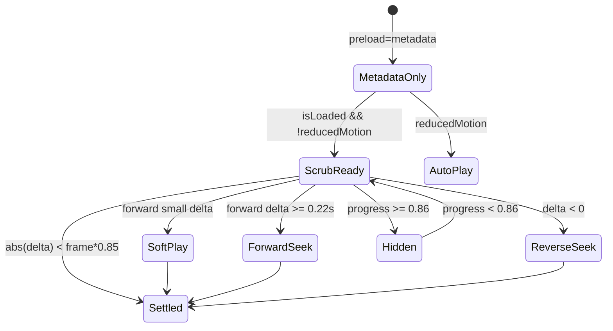

# 03 — Rendering Analysis

**Project:** Home Nº 134  
**Audit date:** 2026-07-28  
**Focus:** Browser rendering pipeline, video lifecycle, compositing, paint, layout, animation conflicts

---

## 1. Rendering model overview

Home Nº 134 is a **hybrid compositor experience**:

| Plane | Technology | Update cadence |
|-------|------------|----------------|
| Film | HTMLMediaElement → decoder → video layer | On seek/play (≤ display refresh) |
| Chromatic grade | CSS gradient div (`translate3d`) | Static (unless parent invalidates) |
| Editorial type | DOM text + opacity/transform | Every GSAP tick via handlers |
| Chrome (nav) | DOM + CSS transitions | Threshold / interaction |
| Closing | DOM + ScrollTrigger opacity/scale | Near end of page |
| Boot / LCP | Pre-React HTML | One-shot |

There is **no Canvas/WebGL/Three.js**. All “cinematic” motion is CSS transforms/opacity + media timeline scrubbing.

---

## 2. Browser rendering pipeline (as this site exercises it)

```
Input (wheel/touch)
  → Lenis virtual scroll (JS)
  → Layout: scroll position updates (scrollable main height ~7× viewport)
  → JS ticker: film drive + style writes
  → Style recalc (inline opacity/transform/visibility)
  → Layout: mostly avoided if only transform/opacity (good)
  → Paint: text/glyphs when opacity changes expose layers; filters if any
  → Composite: video layer + multiple promoted overlay layers
  → GPU: video frame upload + layer blend
```

### Forced synchronous layout risk

**Low–moderate.** Hot path writes `opacity`, `visibility`, `transform` — typically **composite-only**. Risks:

| Risk | Location | Notes |
|------|----------|-------|
| Reading layout in ticker | Not observed | No `getBoundingClientRect` in film handlers — good |
| `ScrollTrigger.update/refresh` | Provider / Closing | `refresh` on rAF after load; `update` gated >0.78 |
| Font loading | Boot | Can cause late text reflow in overlays |
| `100svh` mobile URL bar | ScrollTrack | Viewport resize → layout of section heights |
| Menu `overflow: hidden` on body | Navbar | Occasional layout |

**Verdict:** Classic layout thrashing (`read→write→read`) is **not** the main bug. **Media decode + layer count + text paint** dominate.

---

## 3. Video rendering lifecycle (deep)

### 3.1 Element configuration

```html
<video
  class="video-stage-film"
  src="/videos/cinematic.mp4"
  poster="/videos/poster.jpg"
  playsInline
  muted
  preload="metadata"
  loop={false}
  disablePictureInPicture
/>
```

CSS promotion:

```css
.video-stage-film {
  transform: translate3d(0, 0, 0);
  backface-visibility: hidden;
  isolation: isolate;
}
```

**Intent:** Stable GPU layer for the film.  
**Side effect:** Permanent layer memory for full-viewport video even when paused.

### 3.2 States machine (logical)



### 3.3 Soft-play path (forward)

1. Compute `targetTime = videoTimeFromProgress(filmProgress, duration)`  
2. `delta = targetTime - currentTime`  
3. If `0 < delta < 0.22`: set `playbackRate` up to **3.5**, call `play()`  
4. Browser decodes forward in media pipeline; main thread continues  

**Rendering implication:** Video layer updates at media clock, not necessarily vsync-aligned with overlay opacity updates → occasional **temporal mismatch** between text and picture (feels soft/heavy).

### 3.4 Seek path

Forward: pause → `currentTime = quantizeToFrame(target)` (24 fps grid) ≤ every 24ms  
Reverse: pause → quantized seek ≤ every 33ms  

**With 9 keyframes + B-frames:**

```
Seek to time T
  → demux find sample
  → jump to prior IDR (up to ~1.67s earlier)
  → decode P/B chain to T
  → upload frame to GPU
```

At 30 seeks/sec reverse, overlapping decode jobs queue → **main thread may wait on media events**, compositor shows stale frame, FPS collapses.

### 3.5 Visibility hide at progress ≥ 0.86

Sets `visibility: hidden` and pauses. Good for stopping decode when closing section covers the stage. Ensure closing background fully occludes (`bg-ink`) — it does.

### 3.6 Poster ↔ video handoff

LCP shell shows poster; React video also has poster attribute. Possible **double decode** of same still until video shows first frame. Shell removed ~80ms after intro takeover.

---

## 4. Compositing & layers

### Likely compositor layer candidates

| Element | Why promoted | Persist? |
|---------|--------------|----------|
| `.video-stage-film` | transform3d + video | Always |
| `.video-stage-grade` | transform3d | Always |
| `.chapter-panel` ×6 | transform3d + force3D + opacity anim | Always in DOM |
| Intro content | intermittent translate3d | While intro visible |
| Navbar header | CSS transitions on transform/opacity/bg | Often |
| Boot loader | transforms during boot | Until removed |
| Closing logo | force3D scale/opacity | While ST active |
| Mobile menu | opacity/transform | When used |

### Layer budget problem

Apple/Stripe cinematic pages typically keep **1 hero media layer + 1–2 type layers**. This project can hold:

> **video + grade + 6 chapter panels + intro + nav (+ menu)** ≈ **10+ layers** over a full-screen video.

Each video frame update may force re-composite of the stack. On Intel UHD / Apple low-power GPU, this shows as scroll heaviness even when JS time looks “fine” in isolation.

### `contain: layout style paint` on `.chapter-panel`

**Good:** Limits paint invalidation scope.  
**Caveat:** Each panel is still a full `inset-0` stacking context; containment does not eliminate per-layer blending cost.

---

## 5. Paint analysis

### Expensive paint triggers present

| Trigger | Where | Severity |
|---------|-------|----------|
| Large serif text opacity fades | Chapter/Intro | High — glyph raster / AA |
| Vertical writing-mode label | Chapter (`writing-mode: vertical-rl`) | Medium — niche path |
| Gradient overlays | Grade layers | Low–medium |
| `drop-shadow` on logo | Closing | Medium |
| `bg-ink/90` navbar transition | Navbar scrolled | Low |
| `antialiased` fonts globally | globals.css | Baseline cost |

### Paint flashing possibilities

- Rapid opacity thrash on multiple panels during chapter crossfade  
- Video seek showing brief prior GOP frame (decode catch-up) — perceived as flash  
- Boot `background: transparent` reveal onto poster  
- Mute control opacity window at start  

**Recommendation (analysis only):** Prefer crossfading **two** text buffers; freeze video layer updates during extreme seek backlog (show last good frame + reduce seek rate).

---

## 6. Transform & opacity usage

### Aligned with best practices

- Motion uses `translate3d` / `scale` / `opacity` (compositor-friendly)  
- Closing explicitly avoids filter blur (comment in code) — excellent  
- Quantized frame seeks try to land on encoded frames  

### Anti-patterns / conflicts

| Issue | Detail |
|-------|--------|
| Animating opacity on large text | Still paints when layer first appears / AA changes |
| Simultaneous video time change + 6 opacity changes | Two heavy systems same frame |
| `playbackRate` animation vs overlay sine float | Competing “living” motion → visual noise + cost |
| CSS `transition` on Navbar vs imperative film sync | Different clocks |
| Global reduced-motion CSS sets transitions to 0.01ms | Can fight intentional GSAP durations oddly in some browsers |

---

## 7. Animation conflicts matrix

| System A | System B | Conflict | Result |
|----------|----------|----------|--------|
| Lenis lerp | Film progress lerp | Double smoothing | Video lags; soft-play overworks |
| Film soft-play | Overlay locked to raw scroll | Desync | Text leads picture |
| GSAP ticker | CSS transitions | Dual clocks | Micro timing mismatch |
| ScrollTrigger | Lenis | Mitigated by gated update | OK if gate holds |
| Intro float sine | User scroll fade | Partially gated when gap > 0.008 | OK |
| Chapter breath | Active scrubbing | Gated when gap > 0.01 | OK |
| `play()` + `currentTime` seek | Same element | Mode fighting | Stutter |
| LCP shell vs IntroOverlay | Dual brand DOM | Handoff race | Brief double text possible |

---

## 8. Frame drops — causal model

### Typical bad frame (fast reverse scrub on iGPU)

```
0.0ms  ticker starts
0.3ms  lenis.raf
0.5ms  film lerp
0.7ms  video.currentTime = T   ← starts decode job
...    main thread continues overlays ~1–2ms
...    previous decode still running
16ms   vsync: composite OLD video frame + NEW text opacities
32ms   decode completes; late frame presentation
```

Result: **text feels responsive, film feels sticky** — users report “heavy scrolling” even if input latency is OK.

### Typical bad frame (mobile 1080p)

Thermal throttle → decode budget shrinks → seeks coalesce → multi-frame stalls → Lenis continues (lagSmoothing 0) → backlog.

---

## 9. GPU bottlenecks

| Bottleneck | Likelihood | Notes |
|------------|------------|-------|
| Video decode block | **Very high** | 1080p H.264 scrub |
| Texture upload bandwidth | High | New frame each seek |
| Over-compositing fullscreen layers | High | 6+ overlays |
| Fragment blending of gradients | Medium | Fullscreen grades |
| Filter effects | Low–med | drop-shadow only at end |
| 4K DPR oversampling | Medium | `object-cover` on 3x devices still uses 1080 source (decode fixed) but compositor scales |

Integrated GPUs share memory with CPU — decode storms steal bandwidth from compositing.

---

## 10. CPU / main-thread bottlenecks

| Work | Cost |
|------|------|
| Lenis calculations | Low–medium |
| Chapter lobe math ×6 | Low |
| Style string writes ×6–10 | Medium (binding) |
| `setActiveSection` React reconcile | Medium spikes |
| GSAP ScrollTrigger.update | Low–medium when gated |
| Waiting on media / promise play() | Hidden latency |
| Font shaping on first glyph expose | Medium spikes |

`FilmState` object allocation every frame + `opacities` array allocation = minor GC; not primary.

---

## 11. Rasterization

- Text overlays rasterized into layer backing stores when content/opacity thresholds change  
- `clamp(2.75rem, 7vw, 5.25rem)` titles = large raster areas  
- Vertical RL labels add extra raster path on desktop  
- Poster `decoding="sync"` forces main-thread image decode at boot  

---

## 12. Potential rendering optimizations (recommendations only)

### Tier A — Media rendering

1. Re-encode **scrubbing master**: GOP 0.25s or all-intra; consider removing B-frames for scrub asset.  
2. Ship **resolution ladder** (1080 / 720 / 540).  
3. After boot, **fully buffer** 8.6MB film (Blob / MSE / `preload=auto`).  
4. Align seek cadence to **display refresh** and **keyframe map** (seek only to nearby sync samples when under load).  
5. Cap `playbackRate` ≤ 1.5–2.0; avoid seek+play oscillation.  

### Tier B — Compositing

6. Collapse chapter UI to **2 panels** (current/next) or single slot.  
7. Bake grade into video/poster.  
8. Disable eternal sine float on mobile / when `pointer: coarse`.  
9. Latch visibility/opacity writes (delta threshold).  

### Tier C — Pipeline hygiene

10. Re-enable ticker lag smoothing / adaptive degrade.  
11. Single progress master for text+video.  
12. Avoid React setState from ticker; use DOM for section underline.  
13. Replace `drop-shadow` with static asset.  
14. Defer non-LCP fonts.  

### Tier D — Advanced (flagship)

15. WebCodecs Worker decodes into Canvas2D/WebGL texture; main thread only blits.  
16. Pre-extract WebP/AVIF frame sequence for mobile (15s × 12fps × 720p).  
17. OffscreenCanvas transfer.

---

## 13. CSS rendering specifics

### Good

- `text-rendering: auto` (not `geometricPrecision`)  
- Lenis scroll-behavior overrides  
- Focus-visible outline  
- Chapter `contain`  

### Gaps

- No `content-visibility` on closing  
- No `@media (prefers-reduced-data)`  
- `is-touch` unused  
- Duplicate font-face  
- Reduced-motion universal transition kill switch may be overly broad  

---

## 14. Mobile rendering

| Factor | Effect |
|--------|--------|
| 1080p film | Decode thermal limit |
| `syncTouch` | Extra JS scroll work |
| `100svh` | Resize churn when chrome shows/hides |
| Large type | Paint |
| Fixed layers + scrolling body | iOS compositor bugs possible |
| Autoplay policies | muted helps; scrub seeks still hard |

Safari iOS is the **hardest** target for this architecture.

---

## 15. Rendering scorecard

| Area | Score | Notes |
|------|------:|-------|
| Compositor-friendly motion props | 85 | transform/opacity discipline |
| Layer budget discipline | 45 | Too many fullscreen layers |
| Video scrub rendering fitness | 30 | Codec/GOP mismatch |
| Layout thrash avoidance | 80 | Hot path clean |
| Paint cost control | 55 | Big type fades |
| Animation clock unification | 70 | Single ticker, but CSS+media clocks remain |
| Mobile GPU realism | 40 | 1080p+overlays |
| **Rendering overall** | **54 / 100** | |

---

## 16. Key evidence index

| Claim | Evidence |
|-------|----------|
| 1080p24 H.264 | moov `tkhd`/`avc1`/`mdhd` |
| 9 keyframes | `stss` |
| B-frames | `ctts` present |
| Fast start | moov @ 32, mdat after |
| Seek cadence | `filmClock.ts` 24ms / 33ms |
| Rate up to 3.5× | `filmClock.ts` |
| 6 panel writes | `ChapterOverlay.tsx` |
| Layer promotion | `globals.css` + `gsap.set(..., force3D: true)` |
| Gated ScrollTrigger | `ExperienceContext` `scrollP > 0.78` |
| Dual progress | Provider lerp vs Chapter `scrollProgress` |
