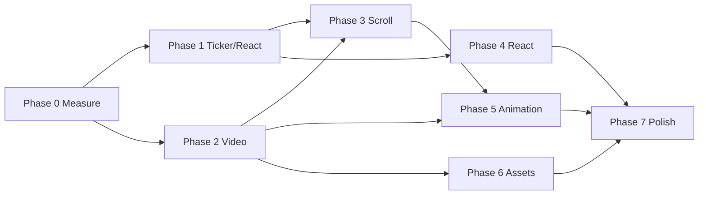

# 04 — Optimization Roadmap

**Project:** Home Nº 134  
**Audit date:** 2026-07-28  
**Constraint from audit:** recommendations only — this file is the implementation plan for a follow-up engineering sprint.

**Goal:** Apple / Stripe / Linear / Vercel–class smoothness on mid Windows iGPU, MacBook, and mobile Safari/Chrome.

---

## How to read this roadmap

Each task includes:

| Field | Meaning |
|-------|---------|
| Priority | P0–P3 |
| Expected improvement | User-visible / metrics |
| Risk | Regression risk |
| Difficulty | 1 (trivial) – 5 (hard) |
| Files affected | Likely touch list |
| Est. time | Engineer-hours (mid-senior) |
| Dependencies | Must precede / unblock |

**Suggested total calendar:** 2–4 weeks for Phases 1–5; Phase 6–7 ongoing polish.

---

## Phase 0 — Hygiene & measurement (do first, 0.5–1 day)

Without baselines, “smoothness” stays anecdotal.

| ID | Task | Pri | Improvement | Risk | Diff | Files | Time | Deps |
|----|------|-----|-------------|------|-----:|-------|-----:|------|
| P0.1 | Establish prod preview FPS protocol (Chrome Perf, scroll reverse/forward, mid laptop + iPhone Safari) | P0 | Enables all later validation | Low | 1 | docs / scripts | 2–3h | — |
| P0.2 | Record long-task + `video` seek event timings during scrub | P0 | Identifies C1 vs H2 share | Low | 2 | temp instrumentation | 3h | P0.1 |
| P0.3 | Remove or ignore nested `RealEstWebsite-main/` + gate `references/` from deploy | P0 | Prevents wrong edits / fat deploys | Low | 1 | `.gitignore`, CI, Docker | 1–2h | — |
| P0.4 | Fix README drift (no Framer Motion / Cursor) | P3 | DX clarity | None | 1 | `README.md` | 0.5h | — |

**Exit criteria:** Written baseline: avg FPS scrubbing reverse on reference devices; LCP; transfer size.

---

## Phase 1 — Critical rendering / ticker fixes

Stabilize the frame loop before rewriting media.

| ID | Task | Pri | Expected improvement | Risk | Diff | Files affected | Time | Deps |
|----|------|---------------------|------|-----:|----------------|-----:|------|
| P1.1 | Re-enable GSAP lag smoothing or adaptive degrade when `frameDelta > 20ms` (reduce seek rate, skip breath) | P0 | Stops death spirals under load; +3–8 FPS recovery | Med | 2 | `ExperienceContext.tsx`, `filmClock.ts` | 4h | P0.1 |
| P1.2 | Latch video `visibility` / avoid redundant style writes | P1 | Minor main-thread savings | Low | 1 | `filmClock.ts` | 1h | — |
| P1.3 | Reuse single `FilmState` object + reused opacity array | P1 | Less GC jitter | Low | 1 | `ExperienceContext.tsx`, `ChapterOverlay.tsx` | 2h | — |
| P1.4 | Move module-level seek throttles into per-instance state | P1 | Correctness under HMR/StrictMode | Low | 1 | `filmClock.ts`, Provider | 2h | — |
| P1.5 | Delta-threshold overlay writes (`\|Δopacity\| < 0.01` skip) | P0 | Fewer compositor updates; +2–5 FPS | Low | 2 | `ChapterOverlay.tsx`, `IntroOverlay.tsx` | 3h | — |
| P1.6 | Remove `setActiveSection` from React; drive nav underline via `data-section` attribute | P0 | Eliminates chapter-boundary React spikes | Med | 2 | `ExperienceContext.tsx`, `Navbar.tsx` | 4h | — |

**Exit criteria:** No React renders during continuous scrub; ticker self-throttles under load.

---

## Phase 2 — Video optimization (highest ROI)

This phase moves the ceiling.

| ID | Task | Pri | Expected improvement | Risk | Diff | Files affected | Time | Deps |
|----|------|---------------------|------|-----:|----------------|-----:|------|
| P2.1 | Re-encode scrub master: 24fps, **GOP ≤ 0.25s** or all-intra; strip B-frames for scrub asset; keep fast-start | P0 | **Massive** seek cost reduction; often +10–25 FPS | Med (quality/size) | 3 | `public/videos/*`, encode scripts | 4–8h | P0.1 |
| P2.2 | Create resolution ladder: 1080 / 720 / 540 (and optionally 480 for low-end) | P0 | Mobile thermal + decode win | Low | 3 | `constants.ts`, `VideoStage.tsx`, `public/videos/` | 6h | P2.1 |
| P2.3 | Source selection by width, DPR, `saveData`, memory heuristics | P0 | Correct asset per device | Med | 3 | `VideoStage.tsx`, new `lib/videoSource.ts` | 6h | P2.2 |
| P2.4 | Post-boot full buffer: `preload=auto` or Blob/MSE for 8–12MB scrub file | P0 | Removes first-scrub network cliffs | Med | 3 | `VideoStage.tsx`, Loader/Provider | 6–10h | P2.1 |
| P2.5 | Rewrite drive policy: seek-only **or** play-only; cap rate ≤ 2×; never seek while playing catch-up | P0 | Stable decode pipeline; Safari less jank | Med | 4 | `filmClock.ts` | 8h | P2.1 |
| P2.6 | Optional HEVC (Safari) + AV1 (Chrome) with H.264 fallback | P2 | Bandwidth/quality | Med | 4 | `VideoStage.tsx`, assets | 1–2d | P2.2 |
| P2.7 | Bake subtle grade into encode; remove DOM grade layer | P1 | −1 fullscreen composite | Low | 2 | encode, `VideoStage.tsx`, CSS | 3h | P2.1 |

**Exit criteria:** Reverse scrub maintains ≥50 FPS on reference Windows iGPU; iPhone 12-class ≥30–45 FPS at 540/720.

**Note:** If P2.1 size balloons (all-intra), prefer short-GOP + P2.2 lower res rather than shipping 30MB.

---

## Phase 3 — Scroll optimization

| ID | Task | Pri | Expected improvement | Risk | Diff | Files affected | Time | Deps |
|----|------|---------------------|------|-----:|----------------|-----:|------|
| P3.1 | A/B `syncTouch: false` on iOS; tune `touchMultiplier` | P0 | Mobile Safari scroll feel | Med | 2 | `ExperienceContext.tsx` | 4h | P0.1 |
| P3.2 | Unify progress: overlays + video share one master (or document intentional offset in frames) | P0 | Perceived tracking; fewer corrective seeks | Med | 3 | Provider, overlays, `filmClock.ts` | 8h | P1.x, P2.5 |
| P3.3 | Reduce Lenis lerp slightly on low-end (`lerp` 0.28–0.35) via device heuristic | P1 | Shorter inertia tails / less chase | Med | 2 | Provider | 3h | P0.2 |
| P3.4 | Touch profile: consider native scroll + snap for coarse pointers | P2 | iOS authenticity | High | 4 | Provider, CSS | 1–2d | P3.1 |
| P3.5 | Keep ScrollTrigger gate; ensure Closing only | P1 | Maintain current win | Low | 1 | Provider, Closing | 1h | — |
| P3.6 | Use `is-touch` class for reduced micro-motion / cheaper shadows | P1 | Mobile GPU headroom | Low | 1 | `globals.css`, overlays | 2h | — |

**Exit criteria:** Finger-follow on iOS feels attached; text/video desync < 1 frame when settled.

---

## Phase 4 — React optimization

| ID | Task | Pri | Expected improvement | Risk | Diff | Files affected | Time | Deps |
|----|------|---------------------|------|-----:|----------------|-----:|------|
| P4.1 | Split context: `FilmRuntime` (stable APIs) vs `ExperienceUI` (mute/loaded) | P1 | Fewer accidental renders | Med | 2 | context module, consumers | 6h | P1.6 |
| P4.2 | Inline 4 icons; remove `react-icons` | P2 | Smaller JS | Low | 1 | Navbar, VideoStage, `package.json` | 2h | — |
| P4.3 | Evaluate Closing lazy — keep or eagerly merge if chunk noise > benefit | P3 | Simpler waterfall | Low | 1 | `App.tsx` | 1h | build analyze |
| P4.4 | Ensure production profiling (no StrictMode skew in reports) | P1 | Correct metrics | None | 1 | process | 0.5h | — |
| P4.5 | Dead code removal: unused motion/constants/scroll bus if truly unused | P2 | Clarity | Low | 1 | `motion.ts`, `constants.ts`, context | 2h | — |

**Exit criteria:** React Profiler quiet during scrub; bundle report reviewed.

---

## Phase 5 — Animation optimization

| ID | Task | Pri | Expected improvement | Risk | Diff | Files affected | Time | Deps |
|----|------|---------------------|------|-----:|----------------|-----:|------|
| P5.1 | Collapse ChapterOverlay to 2-panel crossfade (or 1 slot) | P0 | Big composite/paint win | Med (design) | 3 | `ChapterOverlay.tsx` | 1d | design OK |
| P5.2 | Disable intro/chapter breath/float on mobile & low FPS | P0 | Idle GPU rest | Low | 2 | overlays | 3h | P3.6 |
| P5.3 | Replace closing `drop-shadow` with non-filter treatment | P1 | Cheaper end section | Low | 1 | `ClosingSection.tsx` | 1h | — |
| P5.4 | Align micro-motion to 10–15 Hz or CSS `@keyframes` with pause | P1 | Lower steady-state cost | Low | 2 | overlays | 3h | P5.2 |
| P5.5 | Audit GSAP entrance timelines vs LCP handoff double-brand | P1 | Cleaner first seconds | Low | 2 | Intro, index.html, Loader | 4h | — |
| P5.6 | Narrow global reduced-motion CSS hammer if it fights GSAP | P2 | A11y correctness | Med | 2 | `globals.css` | 3h | QA |

**Exit criteria:** Max 2 simultaneous text layers over video; no perpetual sine transforms on mobile.

---

## Phase 6 — Asset optimization

| ID | Task | Pri | Expected improvement | Risk | Diff | Files affected | Time | Deps |
|----|------|---------------------|------|-----:|----------------|-----:|------|
| P6.1 | Poster → WebP/AVIF + JPEG fallback; resize true display needs | P1 | Faster LCP bytes | Low | 2 | `public/videos/`, `index.html` | 3h | — |
| P6.2 | Preload only LCP fonts (sans 300 + serif 300); defer 200/500 | P1 | Less bandwidth contention | Low | 1 | `index.html` | 1h | — |
| P6.3 | Deduplicate `@font-face` (HTML vs CSS) | P2 | Maintainability | Low | 1 | `index.html`, `globals.css` | 1h | — |
| P6.4 | Delete unused `src/assets/*`, `public/icons.svg` | P2 | Hygiene | None | 1 | assets | 0.5h | — |
| P6.5 | Cache headers / SW for video+fonts (repeat visit) | P2 | Instant return scrub | Med | 3 | hosting config / SW | 1d | deploy target |
| P6.6 | Optional: generate mobile frame sequence fallback | P3 | Nuclear option for weak decode | High | 5 | new pipeline | 3–5d | P2 fail |

**Exit criteria:** Critical path ≤ poster + 2 fonts + critical JS; video fetched after interactive boot.

---

## Phase 7 — Final polish & production readiness

| ID | Task | Pri | Expected improvement | Risk | Diff | Files affected | Time | Deps |
|----|------|---------------------|------|-----:|----------------|-----:|------|
| P7.1 | OG/Twitter meta + social image | P2 | SEO/share | Low | 1 | `index.html` | 2h | design |
| P7.2 | Accessibility pass: overlay announcements, skip link, focus trap menu | P1 | A11y score | Low | 2 | Navbar, overlays | 6h | — |
| P7.3 | RUM: FPS meter sampled, seek latency, device tier | P1 | Regression detection | Low | 3 | new `lib/perf.ts` | 1d | analytics |
| P7.4 | Bundle visualizer in CI budget | P2 | Guardrails | Low | 2 | CI, vite plugin | 4h | — |
| P7.5 | Cross-browser QA matrix (Chrome/Edge/FF/Safari iOS/mac) | P0 | Ship confidence | — | 2 | QA checklist | 1–2d | Phases 1–5 |
| P7.6 | Prefers-reduced-data path (static poster experience) | P2 | Inclusive perf | Med | 3 | Provider, VideoStage | 6h | P2.3 |
| P7.7 | Final encode quality pass vs brand references | P1 | Visual fidelity | Med | 2 | videos | 4h | P2 |

**Exit criteria:** Documented pass on QA matrix; production readiness ≥ 80.

---

## Phase dependency graph

**Critical path:** P0 → P2.1 → P2.2/P2.5 → P3.2 → P5.1 → P7.5

---

## Effort vs impact matrix

| | Low effort | High effort |
|--|------------|-------------|
| **High impact** | P1.1 lagSmoothing; P1.5 opacity latch; P1.6 DOM section; P2.1 re-encode; P3.1 syncTouch; P5.2 kill float mobile; P6.2 font preload trim | P2.2–P2.5 ladder + drive rewrite; P5.1 2-panel overlay; P3.4 native touch scroll; WebCodecs (future) |
| **Low impact** | Dead code, README, icons inline | Multi-codec packaging, SW perfection |

---

## Recommended sprint sequencing (example)

### Sprint A (3–4 days) — “Stop the bleeding”

- P0.1–P0.3  
- P1.1, P1.5, P1.6  
- P2.1 re-encode short-GOP 1080 + 720  
- P3.1 syncTouch experiments  

### Sprint B (4–5 days) — “Media productization”

- P2.2–P2.5  
- P3.2 unify progress  
- P5.1–P5.3  

### Sprint C (3–4 days) — “Ship quality”

- P4.1–P4.2  
- P6.1–P6.4  
- P7.2, P7.5, P7.7  

---

## Success metrics (definition of done)

| Metric | Target |
|--------|--------|
| Reverse scrub FPS (ref Windows iGPU) | ≥ 50 sustained |
| Reverse scrub FPS (iPhone 12-class @720/540) | ≥ 40 sustained |
| Video-vs-text desync when finger down | ≤ 1 frame visual |
| LCP | ≤ 2.5s on 4G Fast |
| React renders during scrub | 0 |
| Main-thread long tasks >50ms during scrub | Rare / none after buffer warm |
| Transfer for first interaction | Poster + fonts + JS; video not blocking LCP |

---

## Explicit non-goals (for this roadmap)

- Rewriting in Three.js/WebGL unless Phase 2 fails on target devices  
- Adding Framer Motion (not needed; would add dual animation runtime)  
- Multi-route marketing site expansion  
- Pixel-perfect recreation of 65MB reference master bitrate  

---

## Ownership cheat sheet

| Area | Primary files |
|------|----------------|
| Ticker / Lenis | `src/context/ExperienceContext.tsx` |
| Scrub math | `src/lib/filmClock.ts`, `src/lib/constants.ts`, `src/lib/motion.ts` |
| Video element | `src/components/layout/VideoStage.tsx` |
| Overlay paint | `src/sections/ChapterOverlay.tsx`, `IntroOverlay.tsx` |
| Boot/LCP | `index.html`, `Loader.tsx` |
| Closing ST | `ClosingSection.tsx` |
| Styles/layers | `src/styles/globals.css` |
| Encode assets | `public/videos/`, `references/` (source only) |
